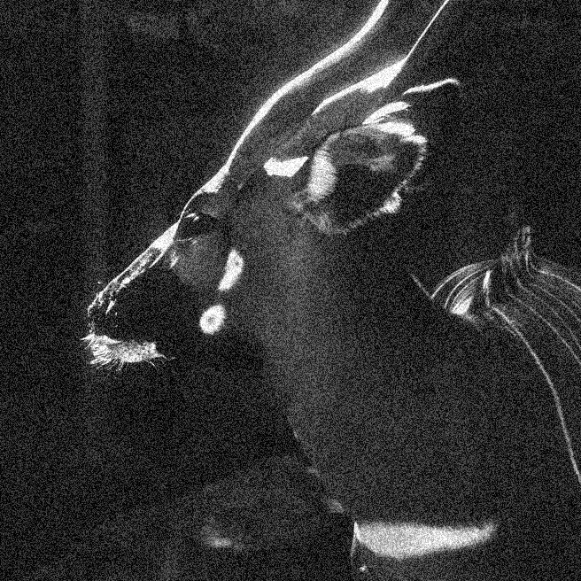
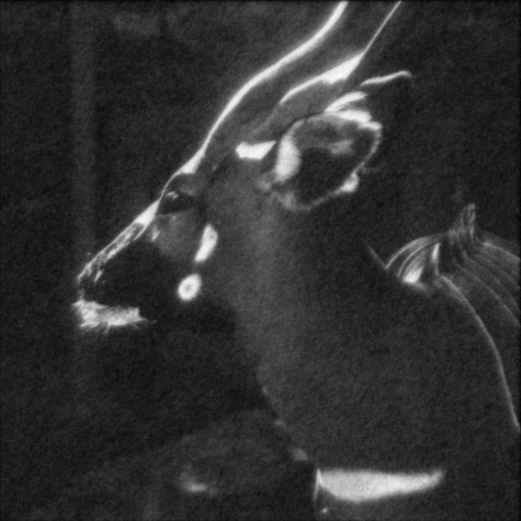
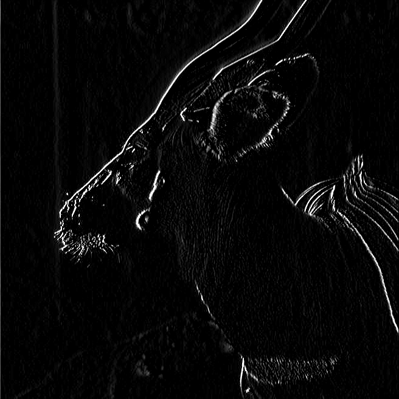
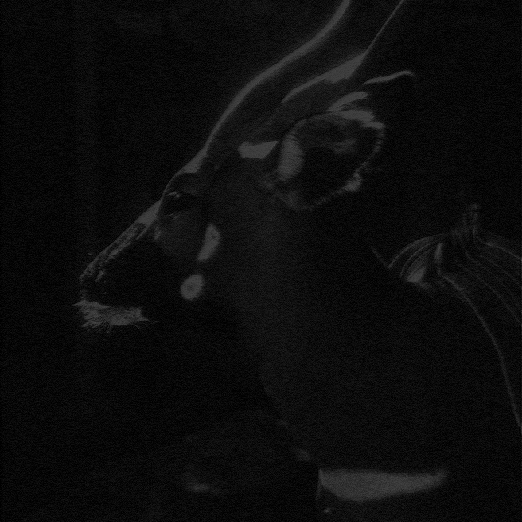

# Challenge 1 — Image Filtering and Denoising

This project completes the Numerical Linear Algebra assignment on image filtering and denoising. Starting from a grayscale deer image, it adds random noise and applies smoothing, sharpening, and edge detection filters. The image operations are represented as sparse matrix–vector products, and two linear systems are solved with iterative methods: the first with LIS and the second with Eigen.

The main implementation is in `challenge.cpp`. It uses Eigen for dense and sparse linear algebra and `stb_image` for image input and output. The course container `quay.io/pjbaioni/amsc_mk:2025` provides the required C++ environment, Eigen, and LIS.

## Input and generated files

Place `deer.jpg` in the project directory. The program reads this filename from its current working directory. The following files are generated there:

| File | Description |
| --- | --- |
| `noisy_deer.png` | Original image with random pixel noise |
| `smoothed_noisy_deer.png` | Noisy image after average smoothing |
| `sharpened_deer.png` | Original image after sharpening |
| `A2.mtx`, `w.mtx` | Matrix and right-hand side exported for the LIS solve |
| `solution_deer.png` | LIS solution vector `x` rendered as an image |
| `edge_detected_deer.png` | Original image after Sobel edge detection |
| `solution_y.png` | Eigen solution vector `y` rendered as an image |

The task 9 image requires the LIS solver output `x.mtx` to be present in the working directory before running `challenge`.

## Assignment tasks

1. **Load the image.** Read `deer.jpg` as a single-channel grayscale image and copy its pixel values, in the range 0–255, into an Eigen matrix. The program reports the matrix dimensions.
2. **Add noise.** Add a random fluctuation between −50 and 50 to each pixel, clamp the result to 0–255, and save `noisy_deer.png`.
3. **Reshape and measure.** Flatten the original image into vector `v` and the noisy image into vector `w`. The program reports their sizes and the Euclidean norm of `v`.
4. **Build the average-smoothing operator.** Construct sparse matrix `A1` for the `Hav1` kernel and report its number of nonzero entries. Pixels beyond the image boundary are treated as zero.
5. **Smooth the noisy image.** Compute `A1 * w`, reshape the result, and save `smoothed_noisy_deer.png`.
6. **Build the sharpening operator.** Construct sparse matrix `A2` for `Hsh1`, report its number of nonzero entries, and check whether it is symmetric.
7. **Sharpen the original image.** Compute `A2 * v`, clamp pixel values to 0–255, and save `sharpened_deer.png`.
8. **Export and solve with LIS.** Export `A2` and `w` in Matrix Market format. Use an iterative LIS solver with a preconditioner to solve `A2 x = w` with tolerance `10^-12`. The recorded run used BiCGSTAB with ILU(0), took 18 iterations, and reached a final residual of `2.426823e-13`.
9. **Render the LIS solution.** Read the LIS solution vector `x` from `x.mtx`, map its entries back to image pixels, clamp them to 0–255, and save `solution_deer.png`.
10. **Build the edge-detection operator.** Construct sparse matrix `A3` from the Sobel `Hed2` kernel and check its symmetry. The program reports that `A3` is not symmetric.
11. **Detect edges.** Compute `A3 * v` and save `edge_detected_deer.png`. Values are clipped to the grayscale range 0–255 for PNG output.
12. **Solve with Eigen.** Build `B = 4I + A3` and solve `B y = w` using Eigen BiCGSTAB with an IncompleteLUT preconditioner and tolerance `10^-10`. The program reports the iteration count and the relative final residual, `||By - w||₂ / ||w||₂`. In the recorded run these were 2 iterations and `4.201610469311e-11`.
13. **Render the Eigen solution.** Convert the Eigen vector `y` directly to grayscale pixels, clamp values to 0–255, and save `solution_y.png`.

## Results

The following results were obtained for the 656 × 656 deer image:

| Task | System and method | Tolerance | Iterations | Final relative residual | Output |
| --- | --- | ---: | ---: | ---: | --- |
| 8 | `A2 x = w`; LIS BiCGSTAB with ILU(0) preconditioning | `1.0e-12` | 18 | `2.426823e-13` | `x.mtx`, rendered as `solution_deer.png` |
| 12 | `(4I + A3)y = w`; Eigen BiCGSTAB with IncompleteLUT preconditioning | `1.0e-10` | 2 | `4.201610469311e-11` | `solution_y.png` |

These are the iteration counts and residuals reported by the recorded run. The task 12 residual is computed as `||By - w||₂ / ||w||₂`.

### Result images

<table>
  <tr>
    <td align="center"></td>
    <td align="center"></td>
    <td align="center"></td>
  </tr>
  <tr>
    <td align="center"><strong>Noisy image</strong><br>Task 2: random noise added.</td>
    <td align="center"><strong>Smoothed noisy image</strong><br>Task 5: `Hav1` applied.</td>
    <td align="center"><strong>Sharpened image</strong><br>Task 7: `Hsh1` applied.</td>
  </tr>
  <tr>
    <td align="center"></td>
    <td align="center"></td>
    <td align="center"></td>
  </tr>
  <tr>
    <td align="center"><strong>LIS solution</strong><br>Task 9: solution `x` rendered as an image.</td>
    <td align="center"><strong>Edge detection</strong><br>Task 11: `Hed2` applied.</td>
    <td align="center"><strong>Eigen solution</strong><br>Task 13: solution `y` rendered as an image.</td>
  </tr>
</table>

## Run with Docker on macOS

Install and start Docker Desktop, then download the course image:

```bash
docker pull quay.io/pjbaioni/amsc_mk:2025
```

From the project directory, create a container and mount the project at `/shared-folder`:

```bash
docker run --platform linux/amd64 -it --name amsc \
  -v "$(pwd):/shared-folder" \
  quay.io/pjbaioni/amsc_mk:2025 /bin/bash
```

On an Intel Mac, `--platform linux/amd64` can be omitted. The `docker run` command creates the container only the first time. To start that existing container later and open a shell, run these commands from the Mac Terminal:

```bash
docker start amsc
docker exec -it amsc /bin/bash
```

Inside the container, compile the program and run it once to generate `A2.mtx` and `w.mtx`:

```bash
source /u/sw/etc/bash.bashrc
module load gcc-glibc
cd /shared-folder
g++ -O2 -std=c++17 -I"$mkEigenInc" challenge.cpp -o challenge
./challenge
```

The generated PNG and Matrix Market files will appear in the project directory on the host. To complete task 8, load LIS and solve `A2 x = w` from the same `/shared-folder` directory:

```bash
module avail lis
module load lis
lsolve A2.mtx w.mtx x.mtx rhistory.txt \
  -i bicgstab -p ilu -tol 1.0e-12 -print out
```

`lsolve` writes the solution to `x.mtx` and the residual history to `rhistory.txt`. The options select BiCGSTAB, ILU(0) (the default ILU fill level), a tolerance of `1.0e-12`, and residual output. Then run `./challenge` again to load `x.mtx` and generate `solution_deer.png`. For later sessions, start the stopped container with `docker start amsc`, open it with `docker exec -it amsc /bin/bash`, and return to `/shared-folder` before running commands.

## Linux with Apptainer

Pull the course image once:

```bash
apptainer pull docker://quay.io/pjbaioni/amsc_mk:2025
```

From the project directory, start a shell with the directory bound into the container:

```bash
apptainer shell --bind "$PWD:/shared-folder" amsc_mk_2025.sif
```

Then follow the same environment, compilation, and run commands listed above.

## References

- `Challenge1.pdf` — assignment requirements and filter definitions.
- `Lab0/Lab0a_SetUp.md` — course environment setup instructions.
- `Lab1/Lab1_IntroEigen.md` — Eigen and image handling with `stb`.
- [LIS User Guide](https://www.ssisc.org/lis/lis-manual-en.pdf) — `lsolve` syntax and solver options.
